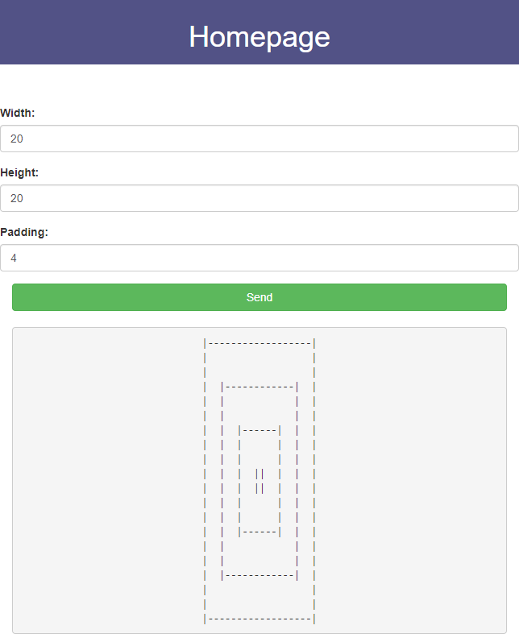
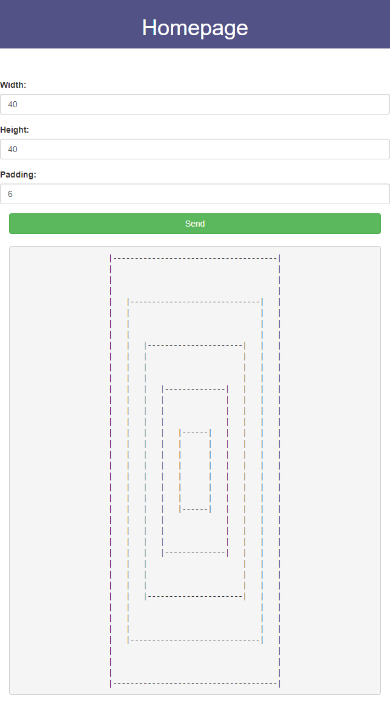
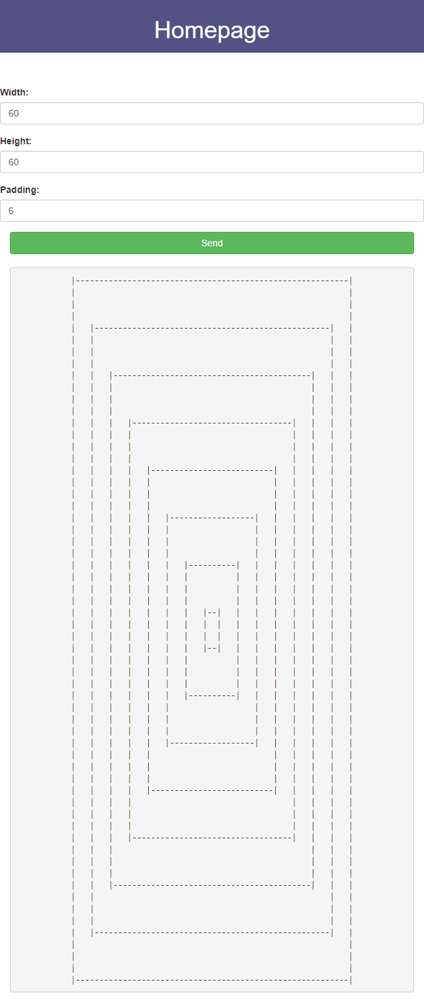

# Infinite recursive shape

These repo contains the finished programmatic solution of the Infinite Recursive Rectangle.

## Screeshots

## Instructions
1. Clone repo
2. Run `npm install`

## Usage
1. Run `npm start`
2. Navigate to `localhost:7000`

## Getting Help

Need some help? Leave a comment or drop me email on karanp41@gmail.com.

